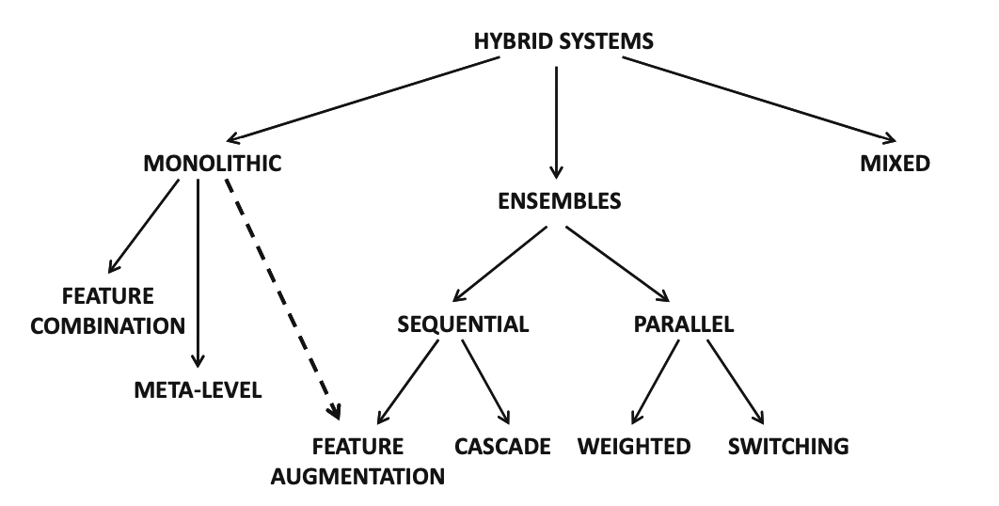
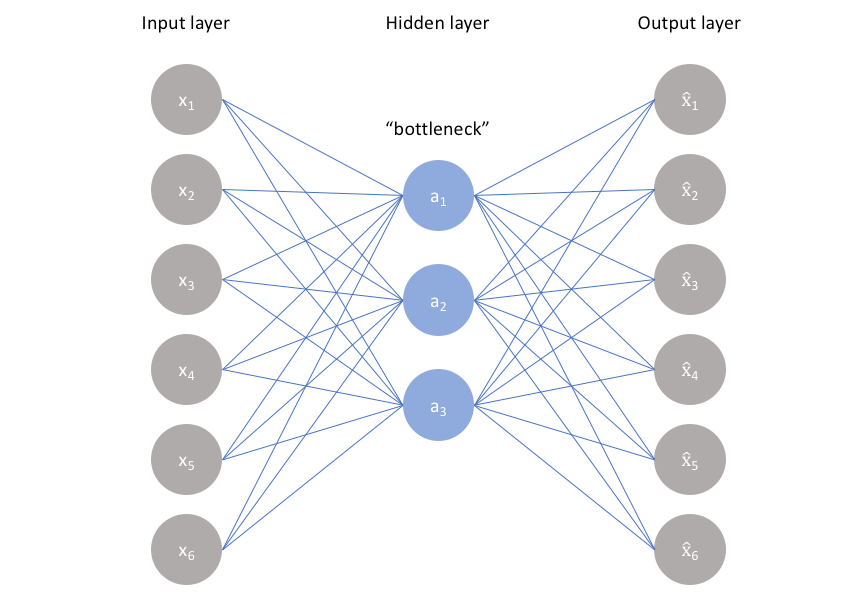
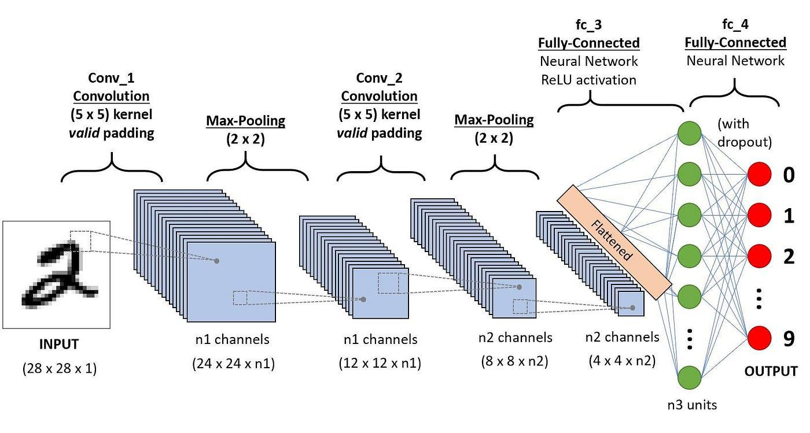

  
## **Where are you in the series?**

1. [Recommender Systems for Dummies](https://medium.com/@paul0/recommender-systems-for-dummies-84d4d0b5b58e)

2. [Evaluating Recommender Systems](https://medium.com/@paul0/evaluating-recommender-systems-4915c22ad44a)

3. [Collaborative Filtering Recommenders](https://medium.com/@paul0/collaborative-filtering-25d181107082) (1/3)

4. [Content-Based Recommenders](https://medium.com/@paul0/content-based-rs-2fe690e2300f) (2/3)

5. [Knowledge-Based Recommenders](https://medium.com/@paul0/knowledge-based-rs-b4547b84108a) (3/3)

6. **Making Recommenders Better ◀️**

G

ood job reaching the end of the series! Now you know a lot about the basics of recommender systems. What now? Now we discuss ways we can improve upon the previous approaches we covered. We’ve gone over so many different approaches each with their own pros and cons. There are countless ways to make recommenders stronger and we will be looking at two common approaches.

# **Hybrid**

The hybrid approach, as its name suggests, takes advantage of different strengths of the three main recommenders (CF, CB, KB) and combines them in a way that makes the resulting recommender much stronger. There are three approaches within hybrid recommenders: ensemble, monolithic, and mixed.

**Ensemble** — *results* from different algorithms are *combined* into a single output
**Monolithic** — various data types are used
**Mixed Systems **— *results* from different algorithms are shown *side-by-side*

Taxonomy of hybrid systems. Image by Aggarwal (2016).

Within each category, there are different implementations but for now, we will explore hybrid recommenders from a more general perspective. What different algorithms could we use together? Below are some examples.

* Knowledge-Based Ensemble: This type of hybrid recommender combines the strengths of knowledge-based systems with other recommender types. We know that the benefits of knowledge-based algorithms is that it doesn’t require user data and can thus avoid the cold-start problem. This is a problem that both CF and CB recommenders face and so this recommender starts with a KB recommender and then uses CF and CB once sufficient data is collected.

* Content-Boosted Collaborative Filtering: This type of hybrid recommender combines the strengths of both content-based and collaborative filtering techniques. Content-based filtering is used to analyze the features of items, and collaborative filtering is used to capture the user-item interactions. The content features are then used to adjust the similarity calculations in collaborative filtering, which leads to more personalized recommendations.

* Collaborative-Boosted Content Filtering: This type of hybrid recommender also combines content-based and collaborative filtering techniques, but in a different way. Collaborative filtering is used to generate a set of candidate items, and then content-based filtering is used to rank those items based on their features. This method is useful when there is a large number of items and the collaborative filtering algorithm struggles to efficiently generate recommendations.

* Model-Based Hybrid Recommenders: This type of hybrid recommender combines different recommendation algorithms into a single model. For example, a model could combine matrix factorization and association rule mining techniques. The advantage of this approach is that it can capture the strengths of different algorithms while minimizing their weaknesses. The challenge, however, is to determine the appropriate weighting and combination of the different algorithms in the model.

# **Machine Learning**

Ah, Machine Learning. A sure-fire way to improve classification models. ML is mostly used in collaborative filtering and content-based recommenders (and various hybrid recommenders). The implementation or deep-dive into ML in recommenders will not be done as there are many resources available online and that is a large topic to get into

**ML in Collaborative Filtering**

Well, in our model-based CF approach, we need to create a model that can fill in the empty cells of our user-item matrix. SVDs and its variations have been the main go-to until ML techniques completely outperformed traditional methods. Below are several ways in which ML can improve model-based CF.

1. Improve on Matrix Factorization — SVD is good but it only captures linear relationships within the data. The product of three matrices to best approximate the original matrix is limited as it cannot perform nonlinear transformation and can miss out on more complex patterns. ML can perform matrix factorization much better as it is not limited to linear transformations. This creates a much more accurate model.

2. Use much more Data Types — Given that we have a lot of information about the user and/or item (what user watches, searches, age, location, gender, etc.), it can be hard to include all of the data we have in traditional approaches as it is not scalable and high-dimensionality can be infeasible. With ML, embeddings are a great way to reduce the dimensionality of various data types and can be directly inputted into neural networks. This provides the model with a greater quantity and quality of data and can only improve upon traditional methods.

3. Learn the user-item matrix without Matrix Factorization — ML can also just go forth and predict the user-item matrix by finding patterns within the original matrix. Autoencoders (AE) are one such popular way to do that. As shown below, the architecture of this deep learning technique is to input the thing we want to recreate and outputting a good approximation of that thing. The middle layer forces the model to learn the input layer with a great reduction in dimensionality and nodes and thus learns only the essential qualities of the input. This is then generalized back into the same dimension as the input layer to create the output, an approximation of the input. In recommender systems, the input can be the user-item matrix with missing ratings. By training the AE to learn the patterns of the input, it is forced to learn the essential patterns of the matrix because of the bottleneck hidden layer. The output is the user-item matrix but with all the missing entries filled out.

Image by Jordan (2018).

**ML in Content-Based**

How does it benefit content-based algorithms? Well we have already touched on one method with NLP. Since a lot of data we have about an item ends up being text-based, NLP has been extremely useful in extracting features from such text-based data. However, ML isn’t just limited to extracting features from texts and items also have other forms of data. What other forms of data can be used? Images, audio, and video of course.

One deep learning neural network I want to introduce here is the convolutional neural network (CNN). It is well-known for working well with image data.

Image by Ratan (2020).

You can see that it is composed of three types of layers: convolution, pooling, and fully-connected layers. What are they?

* In convolutional layers, the CNN applies filters to the input image in order to extract features, such as edges, shapes, and textures. These filters are learned during the training process, and they can be reused across different regions of the input image.

* Pooling layers are used to reduce the dimensionality of the feature maps produced by the convolutional layers. This helps to decrease the computational requirements of the network while retaining important features.

* The fully connected layers are used to classify the image or video based on the features extracted by the convolutional and pooling layers. In these layers, the network combines the extracted features and makes a prediction about the class or category of the input image or video.

Using CNN, the capability of our content-based recommenders expand tenfold. We can now extract features from images and use that to learn a user’s preference and recommend personalized items. However, this isn’t all. Through CNN, there are ways to extract features from audio. How does a model for learning images learn sounds? Easy, convert the sounds into images and everything else is the same.

Spectrograms are a fascinating way to visualize sound in an accurate manner that takes into account amplitude, period, frequency, etc. of the audio. Ketan Doshi has a great [Medium series on Audio Deep Learning](https://towardsdatascience.com/audio-deep-learning-made-simple-part-1-state-of-the-art-techniques-da1d3dff2504) that I recommend you check out!

Now that sound and images can be used as data sources, it is no surprise that we can also extract information from videos which is just a combination of sound and images. How exciting!

## **Code Implementation of ML in Model-Based CF**

Here, we implement an Autoencoder that learns the user-item matrix with three simple layers.

**Data Prep**

Autoencoder Model

**Evaluation**

MAE: 0.15602776775088187

RMSE: 0.7032389679040674

Spearman: 0.8605877952195891

We see that it has a great performance with only three layers. This is the same dataset used in our CB and CF chapters and so we can see that it performs better than any of the previous approaches, both for rating accuracy and rank correlation.

This was just a quick introduction into more advanced recommenders. Now that you know all there is to know about the basics of recommenders, find more advanced recommenders in fields you’re interested in to see how they work!

# **Resources**

Aggarwal, C. C. (2016). Recommender Systems. [https://doi.org/10.1007/978-3-319-29659-3](https://doi.org/10.1007/978-3-319-29659-3)

Doshi, K. (2021, May 21). *Audio deep learning made simple (part 1): State-of-the-art techniques*. Medium. Retrieved April 2, 2023, from [https://towardsdatascience.com/audio-deep-learning-made-simple-part-1-state-of-the-art-techniques-da1d3dff2504](https://towardsdatascience.com/audio-deep-learning-made-simple-part-1-state-of-the-art-techniques-da1d3dff2504)

Jeremy Jordan. (2018, March 19). *Introduction to autoencoders.* Jeremy Jordan. Retrieved April 2, 2023, from [https://www.jeremyjordan.me/autoencoders/](https://www.jeremyjordan.me/autoencoders/)

Ratan, P. (2021, January 14). *What is the Convolutional Neural Network Architecture?* Analytics Vidhya. Retrieved April 2, 2023, from [https://www.analyticsvidhya.com/blog/2020/10/what-is-the-convolutional-neural-network-architecture/](https://www.analyticsvidhya.com/blog/2020/10/what-is-the-convolutional-neural-network-architecture/)

